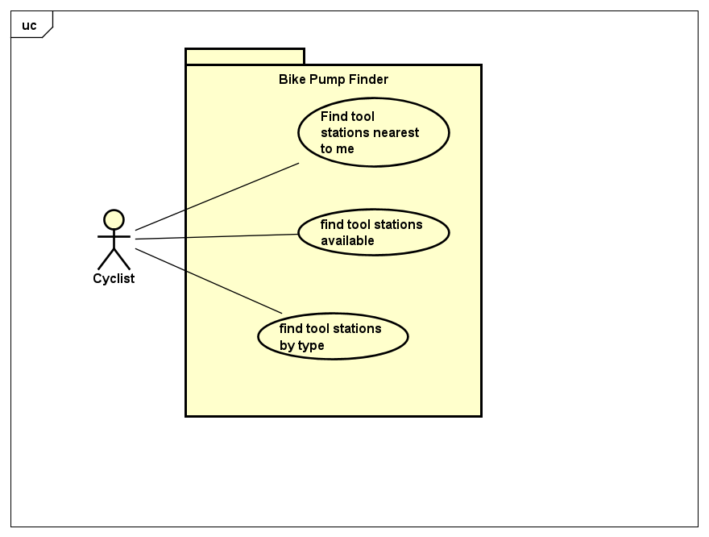

# Requirements

## User Needs

### User stories
User stories capture the needs and wants of my user base.

* As a cyclist I want to find the bike pumps and tools nearest to me, so I can repait a puncture if I get one.
* As a cyclist I want to see all of the tool stations avaiable in my area, so I can plan my ride.
* As A cyclist I want to be able to see which tool stations have pumps so I can top up the tyre pressure.

### Actors
Actos that appear in the following use-cases are as follows:

* Cyclist - a bike user

### Use Cases
TODO: Describe each use case (at least one per team member).
    Give each use case a unique ID, e.g. UC1, UC2, ...
    Summarise these using the use-case template below.

| UC1 | Find tool stations nearest to me | 
| -------------------------------------- | ------------------- |
| **Description** | Show tool station on a map with the cyclist at the centre |
| **Actors** | Cyclist |
| **Assumptions** | None
| **Steps** | <ol><li>select the map option</li><li>Give permission to use my location</li><li>extract station coordinates from database</li><li>centre map on user location</li><li>add a marker for each tool station</li></ol> |
| **Variations** |  |
| **Non-functional** | TODO: OPTIONAL - List of non-functional requirements that the use case must meet. |
| **Issues** |  |

TODO: Your Use-Case diagram should include all use-cases.

## Software Requirements Specification
### Functional requirements

**FR1.1**	The system should get permission to access user location via geolocation object.
**FR1.2**	The system should query the database for tool station location from Open Data Bristol.
**FR1.3**	The system should centre the map on the user location using the map object.
***FR1.4**	The system should add markers for each tool station using the map object.

### Non-Functional Requirements
TODO: Consider one or more [quality attributes](https://en.wikipedia.org/wiki/ISO/IEC_9126) to suggest a small number of non-functional requirements.
Give each non-functional requirement a unique ID. e.g. NFR1, NFR2, ...

Indicate which UC the requirement comes from.
